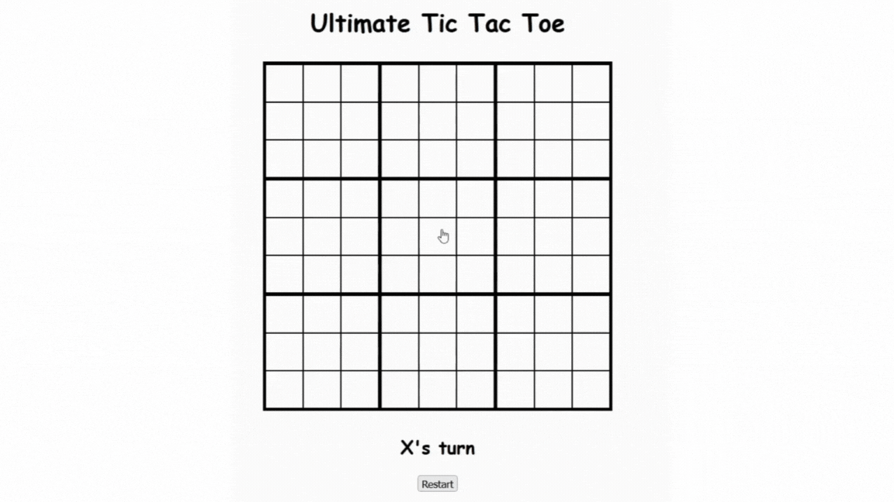

# 🎮 Ultimate Tic Tac Toe

A web-based implementation of **Ultimate Tic Tac Toe** — a strategic twist on the classic game. Built with vanilla JavaScript, HTML, and CSS, this version features an interactive 3x3 grid of Tic Tac Toe boards where players must think ahead and plan their moves carefully.

## 🧠 What is Ultimate Tic Tac Toe?

Unlike regular Tic Tac Toe, **Ultimate** Tic Tac Toe consists of a 3x3 grid of smaller 3x3 Tic Tac Toe boards. The twist?  
The position you play in your current board determines the next board your opponent must play in.

> Example: If you play in the top-left cell of a local board, your opponent must play in the top-left board next.

## 🎥 Demo



## ✨ Features

- 🔁 Two-player gameplay (local)
- ✅ Win detection for both small and large boards
- 🎯 Enforced move targeting based on previous turn
- 🧼 Reset button to start a new game
- 🎨 Simple, responsive UI

## 🚀 Getting Started

1. **Play the Live Game**  
   👉 [Open Ultimate Tic Tac Toe](https://maulasyakur.github.io/ultimate-tic-tac-toe)  
   *(Replace with your actual live link)*

2. **Clone the repository**
   ```bash
   git clone https://github.com/maulasyakur/ultimate-tic-tac-toe
   cd ultimate-tic-tac-toe
